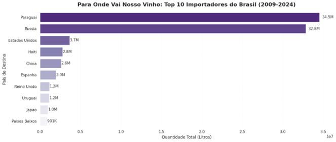
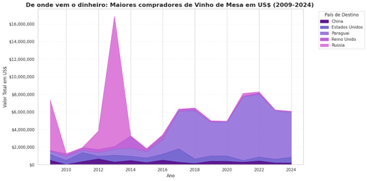
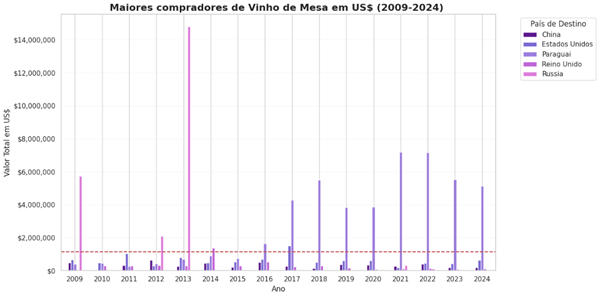
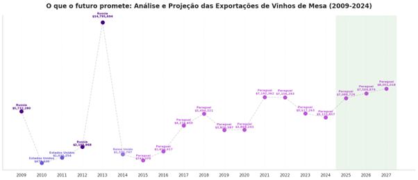

# 🍷 Safra de Dados: Análise de Exportação de Vinhos (2009-2027)

Este projeto que foi desenvolvido para o **Tech Challenge - FIAP Fase 1**, apresenta uma análise quantitativa e qualitativa das exportações de vinhos de mesa brasileiros, identificando os principais destinos por volume e valor monetário, com uma prospecção estatística para o próximo triênio.

## 🛠️ Tecnologias e Metodologia
* **Linguagem**: Python 3.12
* **Manipulação de Dados**: `Pandas` e `Numpy`.
* **Previsão**: Modelo de **Regressão Linear** (`scikit-learn`) para projeções de 2025 a 2027.
* **Visualização**: `Seaborn` e `Matplotlib`.

## 🎯 Contexto do Mercado
O vinho de mesa, produzido a partir de uvas não viníferas como Isabel, Concord e Niágara, representa mais de **80% da produção vinícola nacional**. Este segmento é impulsionado por um modelo de alto volume e menor valor agregado, sendo essencial para a penetração em mercados internacionais de entrada.

### Principais Parceiros Comerciais (2009-2024)
* **Paraguai**: Principal destino comercial, responsável por **51% do valor total (FOB)** das exportações em 2024. Sua liderança deve-se à proximidade geográfica, falta de produção local e aumento no consumo.
* **Rússia**: Teve destaque expressivo entre 2009 e 2013, consolidando uma parceria estratégica após incentivos governamentais como o PEP (Programa de Escoamento da Produção).
* **Estados Unidos e China**: Mercados que demonstram consistência e potencial de expansão em nichos de identidade regional e custo-benefício.


> *Gráfico 1: Top 10 Importadores de Vinhos de Mesa em Quantidade de Litros (2009-2024).*

## 📊 Análise Financeira e Comparativos
O estudo destaca a evolução da receita gerada pelos principais parceiros. Enquanto a Rússia dominou o cenário até 2013, o Paraguai assumiu e manteve a liderança a partir de 2016.


> *Gráfico 2: Evolução do valor total exportado (US$) para os principais destinos.*

A análise considerou um **valor médio de $1.136.597,88** entre os cinco maiores importadores no período analisado. Este benchmark permite identificar períodos de alta demanda excepcional, como o auge das exportações russas e a consolidação paraguaia.


> *Gráfico 3: Comparativo entre os Top 5 importadores e a linha de valor médio.*

## 📈 Projeção 2025-2027
O cenário projetado aponta para a consolidação do Paraguai como o parceiro prioritário do vinho brasileiro. A estabilidade na demanda e a proximidade logística favorecem este posicionamento estratégico para os próximos anos.


> *Gráfico 4: Séries temporais históricas e projeção linear para o próximo triênio.*

## 📂 Estrutura do Repositório
```text
├── data/               # Bases de dados originais (CSVs)
├── notebooks/          # Jupyter Notebook com a análise exploratória
├── img/                # Gráficos exportados para o README
├── outputs/            # Planilhas Excel (.xlsx) geradas automaticamente
├── README.md           # Documentação do projeto
└── requirements.txt    # Dependências do projeto
